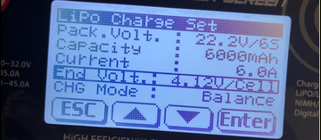

#Batteries

We use 2x 4s Batteries connected in parallel giving the sub about 16.8V when charged. Parallel = long-lasting. The 4s Batteries that we are using: Zeee Power 10000mAh. We have two sets of them, and we keep the ones we are not using charged so we can swap. During the competition, we have two 4s batteries in parallel connected to the little fuse that power the whole submarine. Additionally, there is an isolated 6s Lipo battery that powers only the computer box exclusively.  We use 10 gauge wire for batteries. 2024 Comp Update: We used an additional 6s battery for supply the main computer with 24V(Jetson which takes 12V was not used, so 4S not sufficient).

#Storage Protocol

Store batteries in a cool dry place and the pelican case. They should also be stored in the Lipo boxes. 

#Charging

Use the JST connector from the batteries and plug it into the 4S CN5-3 Pin, take the XT-90 connector from the battery and plug it into the venom charger XT-90s

Turn on the Venom power supply, turn the knob to 24V, and the current will adjust itself while charging.

Set the Venom charger to LiPo. Press charge, and the screen below pops up. Always change the Pack. Volt. to 14.8V/4S (Change). The Capacity to 10000mAh.
Hold Enter to start the charging. For the sus charger, it might give you an error; just try to unplug and replug the connector to the charger itself and it should work hopefully. (Hopes and dreams). Also keep in mind that the venom power went out of business, so if you need a replacement you can probably ask Justin or Eaton or find some old Botz members. 

#Dimensions of Marlin (inside of sub meb):

Length = 24 in
Diameter = 10. in
Volume is about 30. L

#Estimated dimensions of New Sub (inside of sub meb):

Approximated as rectangular prism
Length = 455 mm
Width = 305 mm
Height = 190 mm
Volume is about 26 L
Thickness of walls is .37 in

